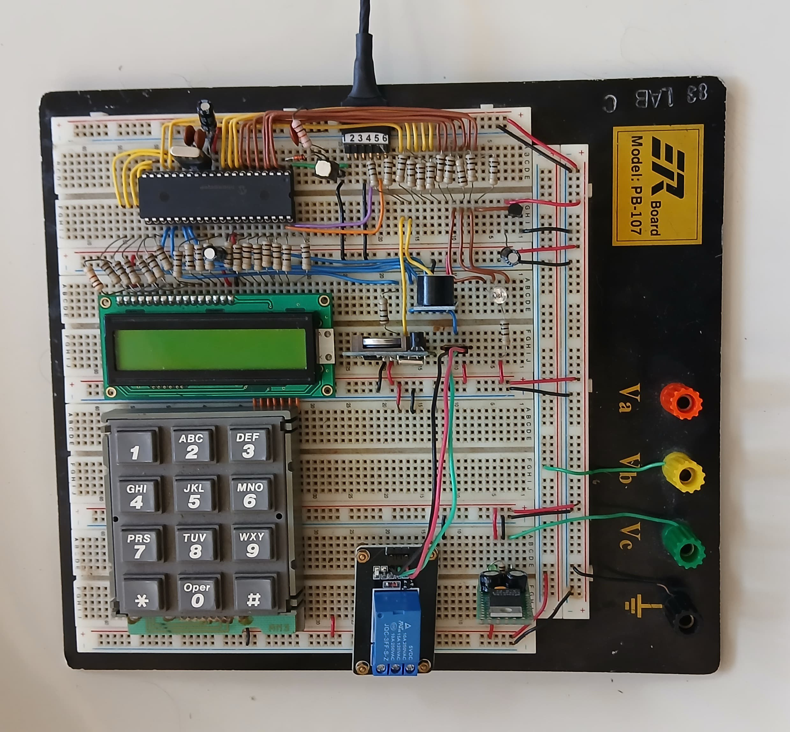
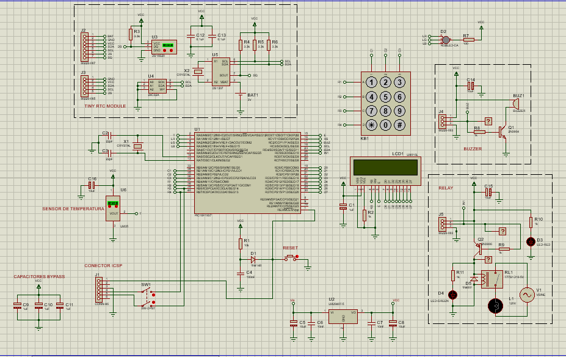

# Control-de-Acceso

## Descripción del proyecto

Diseño e implementación de un circuito basado en un microcontrolador PIC16F1937 que hace la función de control 
de acceso a un recinto, marcando una clave de ingreso de 4 dígitos. 
Para esto el circuito cuenta con un Teclado Matricial (4X3) por el cual se ingresa la clave de acceso y 
una pantalla LCD (GDM1602A) en el cual se muestran los diversos mensajes como la hora, la temperatura
y el código enmascarado con "*". El circuito cuenta con un Led RGB que indica que el acceso se autorizó o fue negado. 
Además, también tiene un Zumbador (Buzzer) que suena sólo cuando el acceso fue negado. 
Se agregó un Relé que controla una carga (por ejemplo un LED), el cual simulará la apertura de la puerta.

Mientras no se esta ingresando ningún código, en la pantalla se muestra el nombre de una empresa ficticia, la
Hora y la Temperatura.

La base de tiempo para el reloj se implementó con un integrado externo que lleva la base de tiempo (RTC), 
el DS1307 con protocolo de comunicación I2C.

Para la parte de la temperatura, se utilizó el sensor Analógico LM35.

## Montaje en protoboard

## Esquemático

## Componentes
- PIC16F1937
- Pantalla LCD 16x2
- Teclado Matricial 4x3
- Reloj en tiempo real DS1307 RTC (Real Time Clock)
- Sensor de Temperatura LM35
- Tiny RTC Module
- Relé
- Buzzer
- Led RGB
- Resistencias, capacitores, diodos, transistores
- Oscilador de cristal de 4MHz