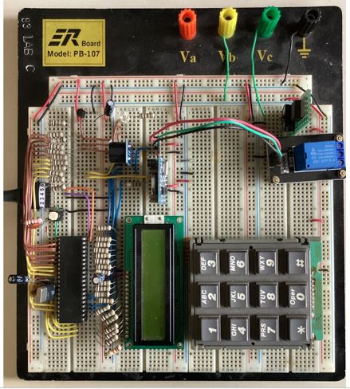
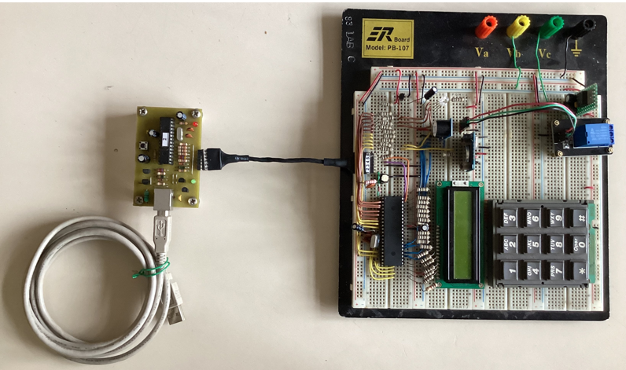

# Control-de-Acceso

## Descripción del proyecto

Diseño e implementación de un circuito basado en un microcontrolador PIC16F1937 que haga la función de control 
de acceso a un recinto, marcando una clave de ingreso de 4 dígitos. 
Para esto el circuito contará con un teclado matricial (4X3) por el cual se ingresará la clave de acceso, 
una pantalla LCD (GDM1602A) en el cual se mostrará los diversos mensajes; el circuito tendrá un led verde y 
uno rojo que indique que el acceso se autorizó o fue negado; tendrá también un zumbador (buzzer) que 
suene solo cuando el acceso fue negado. 
Se agregará un relé que controle una carga (puede ser un led), el cual simulará la apertura de la puerta.

Mientras no se esté ingresando ningún código, en la pantalla se mostrará un mensaje tipo: 
"Bienvenidos a (nombre de una empresa ficticia)" en la primera línea. 
Hora: xx:xx:am/pm Temperatura: xx°C, en la segunda línea.

La base de tiempo para el reloj se implementará con un integrado externo que lleve la base de tiempo (RTC), 
el DS1307 con protocolo de comunicación I2C.

Para la parte de la temperatura, se cuenta con varios tipos de sensores, algunos analógicos y otros digitales por I2C.
Se escogerá el más conveniente para el montaje.
I2C: DS18S20
Analógico: LM35

## Montaje en protoboard

## Esquemático

